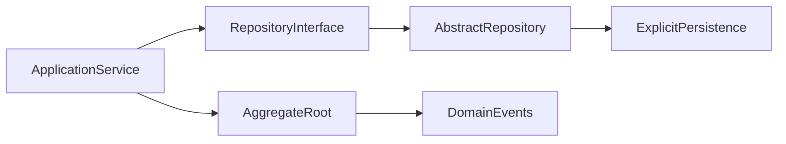

# DDD Core 复审与收口计划

## 审查结论

当前工作区已经把 `ThreadLocal + Jackson Snapshot + JaVers Diff` 从默认仓储能力中移除，方向符合 DDD 与 Clean Architecture：Domain 层只保留聚合、ID、值对象、领域事件和 Repository 抽象，Infrastructure 层用显式模板方法处理持久化。

下一轮实现不应恢复通用 dirty tracking，也不应把持久化状态标记塞回领域模型。核心目标是把当前半完成重构收口成一个干净、可发布的 ddd-core。

## 关键设计判断

- 保留 [`/Users/zhang_yongrui/workspace/chongstack/ddd/src/main/java/com/chongstack/ddd/domain/repository/Repository.java`](/Users/zhang_yongrui/workspace/chongstack/ddd/src/main/java/com/chongstack/ddd/domain/repository/Repository.java) 的领域语义，不再出现 `attach` / `detach`。
- 保留 [`/Users/zhang_yongrui/workspace/chongstack/ddd/src/main/java/com/chongstack/ddd/infrastructure/repository/AbstractRepository.java`](/Users/zhang_yongrui/workspace/chongstack/ddd/src/main/java/com/chongstack/ddd/infrastructure/repository/AbstractRepository.java) 作为轻量模板：`onInsert`、`onSelect`、`onUpdate`、`onDelete`、`isNew`。
- 不再维护 [`DbRepositorySupport`](/Users/zhang_yongrui/workspace/chongstack/ddd/src/main/java/com/chongstack/ddd/infrastructure/repository/DbRepositorySupport.java)、`AggregateManager`、`SnapshotUtils`、`JaversRegistry`、`ThreadLocalAggregateManager` 这一套隐式状态机制。
- 领域事件是业务事实，不是数据库字段 diff。不要用领域事件替代 JaVers 做字段级变更追踪。

## 必改项

1. 修正 Repository 空值语义

- 当前 `Repository.find(ID id)` 文档明确“不存在返回 null”，不符合核心框架的空值约束，也容易导致应用服务遗漏不存在场景。
- 建议改为 `Optional<T> find(ID id)`，并让 `AbstractRepository.find` 包装 `onSelect` 的结果。
- 如果担心兼容性，可以只在当前未发布版本中直接破坏式修正；不要同时保留 `findOrNull` 之类兼容 API，避免核心接口变胖。

2. 收紧 `AggregateIdSetter`

- 当前 [`/Users/zhang_yongrui/workspace/chongstack/ddd/src/main/java/com/chongstack/ddd/infrastructure/repository/AggregateIdSetter.java`](/Users/zhang_yongrui/workspace/chongstack/ddd/src/main/java/com/chongstack/ddd/infrastructure/repository/AggregateIdSetter.java) 在 aggregate 不是 `BaseEntity` 时静默 return，容易让 `setAggregateId` 调用失败但测试不暴露。
- 改为 fail-fast：非 `BaseEntity` 聚合调用 `setAggregateId` 时抛出明确异常，提示该辅助方法只支持继承 `BaseEntity` 的聚合。
- 保持类为 package-private，不把反射工具扩散到公共 API。

3. 清理快照残留注释和依赖心智

- [`/Users/zhang_yongrui/workspace/chongstack/ddd/src/main/java/com/chongstack/ddd/domain/model/BaseEntity.java`](/Users/zhang_yongrui/workspace/chongstack/ddd/src/main/java/com/chongstack/ddd/domain/model/BaseEntity.java) 注释仍写着“支持变更追踪中的快照机制”，必须改掉。
- 重新描述 `Serializable` 的用途：如果仍保留，是为跨进程传输、缓存、消息或框架集成提供基础能力；如果没有明确用途，可考虑从 `BaseEntity` 移除，只保留 `Identifier` / `DomainEvent` 的序列化能力。
- 搜索并确认主代码不再出现 `Snapshot`、`Javers`、`ChangeTracking`、`attach`、`detach` 等默认能力表述。

4. 明确领域事件提取职责

- 当前 `AbstractRepository.extractDomainEvents` 是 protected helper，但注释说 Application Service 调用，二者不完全一致。
- 两种可选方案中建议采用更实用的一种：由具体 Repository 在保存后暴露应用层需要的事件提取方法，或在 `BaseAggregate` 增加 `pullDomainEvents()` 一次性返回并清空。
- 不建议让 `DomainEventPublisher` 进入仓储模板自动发布事件；发布时机应由 Application Service 的事务边界控制。

5. 统一 Java 基线

- `pom.xml` 当前是 Java 21，测试中也使用了 `List.getFirst()`。
- 若 ddd-core 要被 Java 11 项目消费，下一会话应把 `pom.xml` 降到 Java 11 并把 `getFirst()` 改为 `get(0)`。
- 若确认 ddd-core 目标就是 Java 21，则保持现状，但计划中需要明确这是框架发布基线，避免与消费项目预期不一致。

## 实施步骤

1. 更新 Repository API

- 修改 `Repository.find` 返回 `Optional<T>`。
- 修改 `AbstractRepository.find` 为 `Optional.ofNullable(onSelect(id))`。
- 更新 `AbstractRepositoryTest` 中 `find`、`remove` 相关断言。
- 所有新增测试命名保持当前风格：`method_condition_shouldResult`。

2. 收口仓储模板

- 保持 `onSelect` 可返回 null，因为它是 Infrastructure 内部模板方法；公共端口用 Optional 隔离空值。
- 给 `save` / `remove` 增加必要的参数非空检查，建议使用 `Objects.requireNonNull`，不要引入领域异常，因为这是框架契约错误，不是业务规则违反。
- `isNew` 保持可覆盖，继续支持业务预分配 ID。

3. 强化 ID 回写辅助

- `AggregateIdSetter.setId` 对非 `BaseEntity` 直接抛 `IllegalArgumentException`。
- 对反射失败抛 `IllegalStateException`，异常信息包含聚合类型和 ID 类型，便于使用者定位。
- 增加测试覆盖“非 BaseEntity 聚合调用 setAggregateId 会失败”。

4. 处理领域事件 API

- 首选在 `BaseAggregate` 中新增 `public List<DomainEvent> pullDomainEvents()`，内部 copy 后 clear。
- `getDomainEvents()` 继续返回不可变视图；`clearDomainEvents()` 若保留，应在注释中说明是框架生命周期方法，应用业务代码不应调用。
- `AbstractRepository.extractDomainEvents` 可改为调用 `pullDomainEvents()`，保持模板代码简洁。

5. 清理删除文件和依赖

- 确认以下删除保留：`DbRepositorySupport`、`AggregateContext`、`AggregateManager`、`JaversRegistry`、`SnapshotUtils`、`ThreadLocalAggregateManager`、旧 `ChangeTrackingTest`。
- 确认 `pom.xml` 不再包含 `org.javers:javers-core` 和 `jackson-databind`，除非其他主代码重新需要。
- 不要引入新的持久化、ORM 或 diff 依赖。

6. 补齐测试与验证

- 更新 [`/Users/zhang_yongrui/workspace/chongstack/ddd/src/test/java/com/chongstack/ddd/infrastructure/repository/AbstractRepositoryTest.java`](/Users/zhang_yongrui/workspace/chongstack/ddd/src/test/java/com/chongstack/ddd/infrastructure/repository/AbstractRepositoryTest.java)。
- 增加 `Repository.find` 返回 Optional 的测试。
- 增加 `save(null)` / `remove(null)` 参数契约测试。
- 增加事件 `pullDomainEvents` 返回副本并清空的测试。
- 运行 `mvn test`。
- 运行文本检查：确认主代码无 `javers`、`SnapshotUtils`、`attach(`、`detach(`、`ChangeTracking` 残留。

## 注意事项

- 不要把字段级脏检查重新包装成 `DirtyMarker`、`changedFields` 或领域对象上的持久化标记。
- 不要让 Domain 层依赖 Spring、Jackson、JaVers、JPA、MyBatis 或其他基础设施技术。
- `AbstractRepository` 只是基础设施便利模板，不应变成 Unit of Work、事务管理器或事件总线。
- 对核心框架优先选择少量清晰 API；宁可让具体仓储写显式 mapper/SQL，也不要在 core 中维护隐式魔法。
- 修改公共 API 后务必同步测试与注释，避免文档仍描述旧行为。