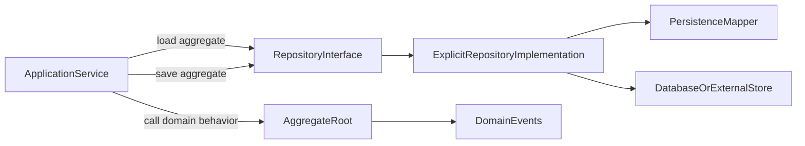

# 简化 Snapshot 仓储设计计划

## 结论

当前 snapshot 设计不建议继续作为默认核心能力。它本质是在 DDD core 中实现一个轻量 ORM Unit of Work：`ThreadLocal` 生命周期、聚合深拷贝、JaVers 元模型注册、Diff 解释、手动清理都需要框架层维护，复杂度明显高于收益。

主要问题集中在：

- 领域仓储接口暴露了 `attach` / `detach`，把持久化追踪概念带进了 Domain 层的 `Repository` 抽象。
- `DbRepositorySupport` 依赖 JaVers 的 `Diff`，仓储子类必须理解第三方 diff 模型，而不是表达自己的持久化意图。
- `SnapshotUtils` 通过 Jackson 私有字段反序列化做深拷贝，要求聚合适配序列化机制，容易受循环引用、多态、私有构造、不可变对象和默认类型信息影响。
- `ThreadLocalAggregateManager` 需要外部在请求/事务/消息结束时手动清理，在线程池、异步任务和嵌套调用中有状态泄漏风险。
- 该机制并没有真正保持“不依赖 ORM”，而是在 core 中复制 ORM dirty checking 的复杂性。

更符合优秀 DDD 实现的方向是：Domain 层只定义聚合、领域行为、领域事件、Repository 接口；Infrastructure 层用显式 mapper/SQL/DAO 实现 `save`，是否全量更新、局部更新、delete-insert 子表、upsert 或乐观锁，由具体仓储实现按聚合持久化模型决定。

## 目标设计

保留核心代码的纯净边界：

设计原则：

- `Repository<T, ID>` 只保留领域语义：`find`、`save`、`remove`。
- 默认仓储支撑只做模板编排，不做自动 diff，不持有跨调用状态。
- 新增/更新判断采用显式策略：默认 `id == null` 为新增；如聚合使用业务分配 ID，具体仓储可以覆盖 `isNew` 或 `save`。
- 聚合内部变化通过领域行为完成；持久化如何落库由仓储实现明确表达。
- 领域事件是业务事实，不是持久化 diff。不要把领域事件降级成字段级变更记录。

## 实施步骤

1. 清理 Domain 层仓储接口

- 修改 [`/Users/zhang_yongrui/workspace/chongstack/ddd/src/main/java/com/chongstack/ddd/domain/repository/Repository.java`](/Users/zhang_yongrui/workspace/chongstack/ddd/src/main/java/com/chongstack/ddd/domain/repository/Repository.java)：删除默认 `attach` / `detach` 方法。
- 保持 `find` / `save` / `remove` 作为最小仓储契约。
- 注意：可考虑将 `find` 的返回值从 `T` 调整为 `Optional<T>`，但这是公共 API 破坏性变更；若当前目标是先简化 snapshot，建议本轮不同时修改。

2. 统一轻量仓储模板

- 修改 [`/Users/zhang_yongrui/workspace/chongstack/ddd/src/main/java/com/chongstack/ddd/infrastructure/repository/AbstractRepository.java`](/Users/zhang_yongrui/workspace/chongstack/ddd/src/main/java/com/chongstack/ddd/infrastructure/repository/AbstractRepository.java)。
- 将它作为唯一默认仓储支撑基类，保留 `onInsert`、`onSelect`、`onUpdate`、`onDelete`。
- 增加可覆盖的 `protected boolean isNew(T aggregate)`，默认实现为 `aggregate.getId() == null`。
- `save` 根据 `isNew` 分派到 `onInsert` 或 `onUpdate`，不做 `onSelect` 探测、不做 snapshot、不抛“未追踪”异常。
- 可把 `DbRepositorySupport.extractDomainEvents` 移到 `AbstractRepository`，作为 protected 辅助方法，仍由 Application Service 在合适时机发布事件。

3. 移除 snapshot/change tracking 实现

删除或废弃以下文件：

- [`/Users/zhang_yongrui/workspace/chongstack/ddd/src/main/java/com/chongstack/ddd/infrastructure/repository/DbRepositorySupport.java`](/Users/zhang_yongrui/workspace/chongstack/ddd/src/main/java/com/chongstack/ddd/infrastructure/repository/DbRepositorySupport.java)
- [`/Users/zhang_yongrui/workspace/chongstack/ddd/src/main/java/com/chongstack/ddd/infrastructure/repository/AggregateManager.java`](/Users/zhang_yongrui/workspace/chongstack/ddd/src/main/java/com/chongstack/ddd/infrastructure/repository/AggregateManager.java)
- [`/Users/zhang_yongrui/workspace/chongstack/ddd/src/main/java/com/chongstack/ddd/infrastructure/repository/ThreadLocalAggregateManager.java`](/Users/zhang_yongrui/workspace/chongstack/ddd/src/main/java/com/chongstack/ddd/infrastructure/repository/ThreadLocalAggregateManager.java)
- [`/Users/zhang_yongrui/workspace/chongstack/ddd/src/main/java/com/chongstack/ddd/infrastructure/repository/AggregateContext.java`](/Users/zhang_yongrui/workspace/chongstack/ddd/src/main/java/com/chongstack/ddd/infrastructure/repository/AggregateContext.java)
- [`/Users/zhang_yongrui/workspace/chongstack/ddd/src/main/java/com/chongstack/ddd/infrastructure/repository/AggregateTrackingContext.java`](/Users/zhang_yongrui/workspace/chongstack/ddd/src/main/java/com/chongstack/ddd/infrastructure/repository/AggregateTrackingContext.java)
- [`/Users/zhang_yongrui/workspace/chongstack/ddd/src/main/java/com/chongstack/ddd/infrastructure/repository/SnapshotUtils.java`](/Users/zhang_yongrui/workspace/chongstack/ddd/src/main/java/com/chongstack/ddd/infrastructure/repository/SnapshotUtils.java)
- [`/Users/zhang_yongrui/workspace/chongstack/ddd/src/main/java/com/chongstack/ddd/infrastructure/repository/JaversRegistry.java`](/Users/zhang_yongrui/workspace/chongstack/ddd/src/main/java/com/chongstack/ddd/infrastructure/repository/JaversRegistry.java)

4. 清理依赖

- 修改 [`/Users/zhang_yongrui/workspace/chongstack/ddd/pom.xml`](/Users/zhang_yongrui/workspace/chongstack/ddd/pom.xml)：移除 `org.javers:javers-core`。
- 如果 Jackson 仅用于 `SnapshotUtils`，同步移除 `jackson-databind`。
- 保留测试依赖和 `slf4j-api`，除非后续确认没有使用。

5. 重写测试

- 删除或重写 [`/Users/zhang_yongrui/workspace/chongstack/ddd/src/test/java/com/chongstack/ddd/infrastructure/repository/ChangeTrackingTest.java`](/Users/zhang_yongrui/workspace/chongstack/ddd/src/test/java/com/chongstack/ddd/infrastructure/repository/ChangeTrackingTest.java)。
- 新增/改名为轻量仓储测试，例如 `AbstractRepositoryTest`。
- 覆盖以下场景：
  - `id == null` 时调用 `onInsert` 并可回写 ID。
  - `id != null` 时调用 `onUpdate`。
  - 覆盖 `isNew` 后支持业务预分配 ID 的新增聚合。
  - `find` 委托 `onSelect`，`remove` 委托 `onDelete`。
  - 若迁移 `extractDomainEvents`，验证提取后会清空聚合事件。

6. 文档和注释调整

- 更新 `AbstractRepository` 类注释：强调它是不带变更追踪的显式仓储模板。
- 删除所有“快照”“变更追踪”“JaVers Diff”“ThreadLocal 清理”的默认能力说明。
- 在注释中说明非 ORM 持久化建议：仓储实现可使用全量更新、局部 SQL、upsert、版本号或子表重建，但这些属于具体基础设施策略，不进入 DDD core。

## 关键注意事项

- 不要把字段级 dirty tracking 替换成领域层 `setDirty` 标记，这会把持久化细节重新带回领域模型。
- 不要把领域事件当作数据库更新脚本。领域事件描述业务事实，例如 `OrderPaid`，不应该描述 `status changed from A to B` 这种技术 diff。
- 不要为了“避免全量更新”在 core 中维护隐式状态。对多数聚合，清晰的仓储实现比通用 diff 更可维护。
- 如果未来确实需要审计或对象差异对比，应作为独立可选模块或应用层能力引入，不应成为 `Repository` 的默认契约。
- `AggregateIdSetter` 仍是反射工具，属于基础设施便利能力。后续如要进一步纯化，可新增 `IdentifiedByRepository` 或显式 ID 生成策略，但不建议和本次 snapshot 简化混在一起。

## 验证方式

- 运行 `mvn test`，确保删除 JaVers/Jackson 后没有残留 import 或编译依赖。
- 重点检查 `src/main/java/com/chongstack/ddd/infrastructure/repository` 下不再出现 `org.javers`、`SnapshotUtils`、`AggregateTrackingContext`、`ThreadLocalAggregateManager`。
- 确认 `domain/repository/Repository.java` 不再包含追踪相关 API。